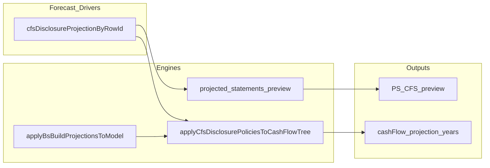

# CFS historic vs projected: disclosure lines

## Principles

- **Historicals** can mirror the filing (10-K/10-Q) line-by-line for audit and tie-out.
- **Projections** are driven primarily by the **Income Statement**, **Balance Sheet** roll-forwards, and **schedules** (WC, capex/D&A, debt, equity, other BS).
- **Issuer-specific cash flow disclosure lines** that do not map to a modeled BS/IS account are **not** auto-forecast. They need either:
  - a **mapping** in Historicals (e.g. `cfsLink` to a BS line), or
  - an explicit **CF disclosure projection policy** (flat to last historical, % of revenue, manual by year, zero, or excluded).

## Product behavior

- **“Not set”** on the Projected Statements CFS builder for these lines means **no policy chosen yet**—not a generic engine failure.
- Policies are stored per row id in **`cfsDisclosureProjectionByRowId`** (see store).
- Optional **“Hide excluded in preview”** removes lines marked **Excluded** from the projected CFS preview (rollup UX).

## Structural CFS lines vs disclosure lines

- **Structural / computed rows** (section subtotals such as cash from operations, investing, financing, and net change in cash) are **rolled up by the CFS engine**. They are identified in code by [`CFS_COMPUTED_ROLLUP_ROW_IDS`](../lib/cfs-structural-row-ids.ts). They are **not** CF-disclosure policy lines: they do not appear in the Cash flow disclosure tab, diagnosis batch, or disclosure-only preview.
- **Disclosure-only rows** are lines classified as `cf_disclosure_only` in [`lib/cfs-line-classification.ts`](../lib/cfs-line-classification.ts)—typically issuer filing lines without a clean BS/IS bridge unless the user maps them in Historicals.

## How the forecast model “closes” (high level)

1. Forecast **Income Statement** and **Balance Sheet** (including schedules: WC, capex/D&A, debt, equity, other BS).
2. Build **Cash Flow Statement** bridges from those forecasts and from non-cash / disclosure assumptions where needed.
3. **Net change in cash** reconciles to the **cash** roll-forward on the balance sheet.

The Cash flow disclosure tab is only for lines that sit outside that bridge in the filing but still need a projection assumption.

## Treatment dictionary (Forecast Drivers overrides)

| User choice | Model effect |
|-------------|----------------|
| Flat to last actual | Projection years use the last historical value on that **same** CFS line. |
| % of revenue | Each projection year = (pct ÷ 100) × **forecast** revenue. |
| Zero | Line is forced to 0 in all projection years. |
| Exclude (rollup) | Line is 0; optional hide from rolled-up CFS preview. |
| Manual by year | User-supplied amounts per projection year. |
| Map to BS / Use IS bridge (Historicals) | **Not** a numeric policy in this tab. User sets `cfsLink` / IS link on the row in **Historicals** so the engine can bridge; then the line is no longer “disclosure-only” in the same way. |

## From policy to Projected Statements and export

Policies live in **`cfsDisclosureProjectionByRowId`**. The same values drive (1) **Projected Statements CFS preview** ([`components/projected-statements-preview.tsx`](../components/projected-statements-preview.tsx) disclosure patch) and (2) **projection-year cells on `cashFlow` rows** after [`applyBsBuildProjectionsToModel`](../store/useModelStore.ts) calls [`applyCfsDisclosurePoliciesToCashFlowTree`](../lib/apply-cfs-disclosure-policies-to-cash-flow.ts).

| Persists as `CfsDisclosureProjectionSpec` | Preview | Export / `cashFlow` rows |
|------------------------------------------|---------|---------------------------|
| `flat_last_historical` | Last hist value on line × projection years | Same |
| `pct_of_revenue` | `(pct/100) × forecast revenue` per year | Same |
| `zero` / `excluded` | 0 | Same |
| `manual_by_year` | User grid per year | Same |
| Bridge via Historicals (no policy) | Engine / routing after classification changes | N/A until mapped |

Shared UI copy for overrides: [`lib/cfs-disclosure-treatment-copy.ts`](../lib/cfs-disclosure-treatment-copy.ts). Resolved BS/IS labels in the tab: [`lib/cfs-disclosure-ui-helpers.ts`](../lib/cfs-disclosure-ui-helpers.ts).

## AI diagnosis + Forecast Drivers tab

- **Coverage snapshot** ([`lib/forecast-drivers-coverage-snapshot.ts`](../lib/forecast-drivers-coverage-snapshot.ts)): one flattened view of IS/BS ids, revenue tree, WC, Other BS, and FD confirmation flags—used to compare each CFS line to what Forecast Drivers already forecasts.
- **Diagnosis API** ([`app/api/ai/cfs-forecast-diagnose/route.ts`](../app/api/ai/cfs-forecast-diagnose/route.ts)): structured JSON per row, including optional **executive summary**, **bridge recommendation**, **double-count risk**, **rejected alternatives**, and **materiality** (see [`types/cfs-forecast-diagnosis-v1.ts`](../types/cfs-forecast-diagnosis-v1.ts)). Server-side validation ([`lib/cfs-forecast-diagnose-validate.ts`](../lib/cfs-forecast-diagnose-validate.ts)) rejects impossible BS/IS links. Structural rollup row ids are **filtered out** of the request and response.
- **Persisted review**: `cfsForecastDiagnosisByRowId` on the project snapshot stores AI output plus user status (`pending` | `accepted` | `edited` | `dismissed`). Accepting a suggestion can write **`cfsDisclosureProjectionByRowId`** when the treatment maps to a policy ([`lib/cfs-ai-treatment-to-policy.ts`](../lib/cfs-ai-treatment-to-policy.ts)).
- **UI**: Forecast Drivers → **Cash flow disclosure** — card layout with resolved link labels, structured AI sections, full-width override select, accept/dismiss. **Projected Statements** “Not set” jumps here (see routing file below).
- **Export parity**: [`applyBsBuildProjectionsToModel`](../store/useModelStore.ts) applies disclosure policies to projection-year **`cashFlow`** row values via [`lib/apply-cfs-disclosure-policies-to-cash-flow.ts`](../lib/apply-cfs-disclosure-policies-to-cash-flow.ts) after the projected CFS engine, so Excel/export matches preview assumptions.

## Related code

- Classification: [`lib/cfs-line-classification.ts`](../lib/cfs-line-classification.ts)
- Structural rollup ids: [`lib/cfs-structural-row-ids.ts`](../lib/cfs-structural-row-ids.ts)
- Policy application: [`lib/cfs-disclosure-projection.ts`](../lib/cfs-disclosure-projection.ts)
- Builder routing: [`lib/cfs-projected-statements-shell-routing.ts`](../lib/cfs-projected-statements-shell-routing.ts)
